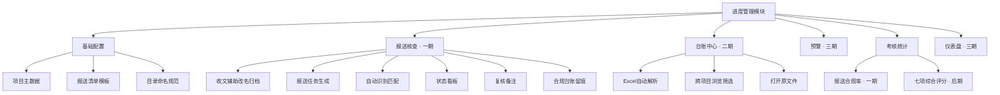

# OPIMS 进度管理模块 需求说明书（V1.1）

**编制**：海外运营中心项目管理部
**日期**：2026-07-24 定稿 V1.0 ／ 2026-07-27 修订 V1.1
**关联文件**：《海外运营中心项目进度管理实施细则》V1.1 及附件 A–F

## V1.1 修订说明

V1.0 定稿后与 OPIMS 现有架构做了对照，发现四处会产生冲突或返工，经确认后调整：

| # | V1.0 原方案 | V1.1 调整为 | 原因 |
|:-:|:---|:---|:---|
| 1 | 新建独立的「进度管理根目录」，其下按项目建 6 个子文件夹 | **复用现有 `01.Project Files/<项目简称>/`**，进度计划入 `05.Schedule/`，进度报告入 `06.Report/` 下月报、周报子文件夹 | 云盘已有成熟结构且 `05.Schedule`/`06.Report` 本就在用。另起一套会让同一项目的文件分散两处，还要多配一个根目录路径 |
| 2 | 文件名用 `{项目代码}`（如 KE01） | **改用 `{项目简称}`** | OPIMS 全系统以项目简称为关联键，文件夹名也是简称。引入项目代码等于多一套标识加一张映射表，人工命名时易错 |
| 3 | 按「项目 × 清单」全量生成应交任务 | **仅对「在建」项目生成** | 库中 30 个项目里完工 16 个。全量生成会产生上百条完工项目的假缺交，看板第一天就没法看 |
| 4 | 截止日在清单里写固定日期 | **拆成「基准月 + 日」两字段，运行时计算** | 「次月 5 日」「季度末月 25 日」是规则不是日期，写死每期都要人工改 |

分期顺序亦作微调（见第 9 章）：一期内先做只读的扫描与看板，再做会写云盘文件的收文改名工具。

---

## 1. 概述

### 1.1 背景与目标

《进度管理实施细则》要求各项目部按周期上报固定文件（月度进度报告、六方面梳理、三月滚动计划、时效日历、索赔台账等），并由中心项目管理部统一监测、预警、考核。当前这些文件散落在各项目云盘文件夹中，中心需要逐一打开翻阅，效率低、易漏报、年终考核缺乏客观依据。

本模块目标：**把"报送核查 + 台账查看 + 预警 + 考核"搬进 OPIMS，让中心项目管理部一屏掌握全部境外项目的进度管控状态。**

### 1.2 模块定位

- **主用户**：中心项目管理部管理员（**已确认：仅中心单点使用**，项目部不登录系统）。
- **数据来源方**：各项目部——通过**云盘/邮件**提交文件，**不直接操作本系统**。中心管理员收文后重命名（含日期）归入对应文件夹，系统读取该文件夹。
- **命名保证方式**：**已确认由中心管理员人工统一命名**（见 4.2.1 辅助工具），故系统按规范命名直接自动识别，无需模糊猜测。
- **运行前提**：沿用 OPIMS 现有「云盘手动同步」模式，系统只读取**本地已同步的项目根目录**，不依赖在线服务器。

### 1.3 与细则/附件的对应关系

| 本模块功能 | 对应细则/附件 |
| :-------- | :----------- |
| 报送核查清单 | 3.3 月报、3.3.2 六方面梳理、2.8 三月滚动计划 |
| 时效日历台账 | 附件 E（Time Bar）、5.1 |
| 索赔跟踪台账 | 附件 D（EOT）、5.4/5.6 |
| 月报关键指标台账 | 附件 B、3.3/3.4 |
| 项目进度/风险台账 | 3.4 境外项目台账、4.1 风险灯 |
| 考核统计 | 7.1 考核指标体系 |

---

## 2. 使用角色与典型场景

| 角色 | 说明 |
| :--- | :--- |
| 中心管理员（主用户） | 配置清单、核查报送、查台账、出考核 |
| 项目部（间接） | 只负责按规范交文件，不登录系统 |

**典型场景：**
- **S1 周期核查**：每周/每月，管理员点"生成本期报送任务"→ 系统扫描各项目文件夹 → 看板显示谁交了、谁没交、谁迟交 → 管理员复核归档。
- **S2 随时查台账**：管理员打开"台账中心"，跨项目查看某类关键信息（如所有项目本月 SPI、所有红色时效预警），需要时一键打开原文件。
- **S3 年终考核**：一键汇总各项目全年报送合规率、缺报次数、进度评分，导出考核报表。

---

## 3. 术语

沿用细则术语（EOT、PCO、Time Bar、SPI、三月滚动计划等），此处不再重复。

---

## 4. 功能需求

### 4.1 基础配置

**4.1.1 项目主数据管理**
维护项目档案：项目代码、项目名称、所在国、合同额、合同工期、开竣工日期、项目经理、管控层级（一级/中小）、云盘文件夹路径、状态（在建/收尾/关闭）。

**4.1.2 报送清单模板**
定义"每类项目每周期应交哪些文件、截止日、是否必交"。系统内置一版默认清单（见下表），管理员可增删改。

**截止日为规则而非固定日期**（V1.1 调整）：拆为「基准月 + 日」两字段，运行时按周期算出实际日期。
- 基准月取值：`当月` / `次月` / `季度末月`
- 例：周期 2026-07 且规则为「次月 5 日」→ 实际截止 2026-08-05

| 文件类型 | 代码 | 周期 | 截止日（基准月 + 日） | 必交 | 存放位置 | 依据 |
| :------- | :--- | :--- | :----- | :--: | :--- | :--- |
| 月度进度分析报告 | MPR | 月 | 次月 5 日 | 是 | `06.Report/Monthly Report/` | 附件 B / 3.3 |
| 月度管理问题及建议（六方面梳理） | SIX | 月 | 当月 30 日 | 是 | `06.Report/Monthly Report/` | 3.3.2 |
| 项目周报 | WKR | 周 | 每周 周五 | 待定 | `06.Report/Weekly Report/` | — |
| 三月滚动计划 | RP3 | 月 | 当月 25 日 | 是 | `05.Schedule/` | 2.8 |
| 合同时效日历（更新） | TBC | 月 | 次月 5 日 | 是 | `05.Schedule/Time Bar/` | 附件 E |
| 工期索赔跟踪台账（更新） | EOT | 月 | 次月 5 日 | 是 | `05.Schedule/EOT/` | 附件 D |
| 季度产值分解表 | QOV | 季 | 季度末月 25 日 | 是 | `06.Report/Monthly Report/` | 2.8 |
| 进度计划 L1／L2／L3／L4 | L1–L4 | 事件 | — | 否 | `05.Schedule/` | 附件 A |

> **说明**：V1.0 的 `SCH`（进度计划编制/更新版）在 V1.1 中细分为 **L1–L4 四个层级**，
> 每级独立编号、独立版本（见 6.2）。
>
> **周报 `WKR` 的必交状态为「待定」**：云盘中已在实际使用周报（`06.Report/Weekly Report/`），
> 截止日定为每周周五。但**周报是否纳入报送核查与考核，待后续确认**。
> 开发时先把它作为一个可配置的清单项接进来（清单项本身支持「是否必交」开关），
> 届时只需在配置里打开或关闭，不需要改代码。

**适用范围**（V1.1 新增）：每个清单项可配置适用的项目状态与管控层级。
系统默认**只对「在建」项目生成应交任务**；完工、停工、未开工项目不纳入核查。

**4.1.3 目录与命名规范配置**
配置项目根目录、项目子文件夹规则、文件命名规则（见第 6 章）。系统据此自动识别文件。

### 4.2 报送核查子模块（需求 1）

**4.2.1 收文辅助命名与归档工具**（把你手动改名这一步自动化）
管理员收到某项目文件后，将文件拖入系统 → 选择「项目 + 文件类型 + 周期」→ 系统按第 6 章规则**自动重命名并移动**到对应项目子文件夹。这一步替代你现在的手动改名归位，既省事又从源头保证命名规范，为后续自动识别打好基础。支持批量处理一次收到的多份文件。

**4.2.2 报送任务生成**
按「周期 × 项目 × 清单」自动生成本期应交任务列表。

**范围限定（V1.1）**：仅对 `project_status = 在建` 的项目生成任务。
理由：库中 30 个项目里完工 16 个、另有停工与未开工，若全量生成会产生上百条
完工项目的假缺交，看板将不可用。项目状态取自 OPIMS 既有项目清单，无需另行维护。

若某项目当期确实无需报送（如刚开工、业主原因暂停），管理员可在 4.2.5 中标记豁免并留备注。

**4.2.3 文件自动识别与匹配**
系统扫描各项目文件夹，按命名规则解析出「项目 + 文件类型 + 周期 + 日期」，与应交任务比对，自动判定状态：

- 🟢 **已交**：找到对应文件且在截止日前
- 🟡 **迟交**：找到文件但晚于截止日
- 🔴 **缺交**：截止日已过仍未找到

> 因命名已由 4.2.1 统一保证，识别为**精确规则匹配**，无需模糊猜测。

**4.2.4 报送状态看板**
矩阵视图：行=项目，列=文件类型，单元格=红黄绿灯 + 提交日期。支持按周期切换、按状态筛选、导出。

**4.2.5 人工复核与备注**
管理员可对系统判定手动修正（如个别未按流程归档的文件），并加备注（"已电话催报""业主原因延后"）。所有修改留痕。

**4.2.6 报送合规台账（考核留痕）**
每期核查结果自动存为快照，累积形成各项目全年报送记录，作为 7.1 考核"月报按时提交率"的客观数据源。

### 4.3 台账中心子模块（需求 2）

**4.3.1 支持的台账类型与关键字段**（系统只存关键信息，非全量）

- **项目进度台账**：项目、当月/累计产值、产值完成率、SPI、风险灯（绿黄橙红）、里程碑完成状态、数据日期。
- **时效台账（Time Bar）**：项目、时效事项、触发日、到期日、剩余天数、预警灯、责任人。
- **EOT 索赔台账**：项目、EOT 编号、类别、请求天数/金额、当前状态、批准结果。
- **月报关键指标**：项目、总体完成率、本期 vs 计划、累计 SV/SPI、偏差等级。

**4.3.2 台账导入**（**已确认：以 Excel 自动解析为主**）
- **主：Excel 自动解析**——直接读取附件 B/D/E 等标准模板 xlsx，按约定表头抽取关键字段入库。前提是各台账**严格使用附件标准模板**；若模板表头调整，需同步维护"表头→字段"解析映射（建议映射可配置，避免改表头就要改代码）。
- **辅：手动录入/编辑**——仅用于个别缺项或临时修正。
- 导入时记录来源文件路径与导入时间，供 4.3.4 一键打开原文件。

**4.3.3 台账浏览与聚合**
跨项目统一列表，支持筛选、排序、搜索（如"所有 SPI<0.9 的项目""本月所有红色时效预警"）。这是相对翻文件夹的核心增值。

**4.3.4 原文件打开（一期）/ 内嵌预览（后期）**
每条台账记录关联原文件路径：
- **打开（一期做）**：调用系统默认程序打开原 Excel/Word。
- **内嵌预览（后期增强）**：只读预览关键页；鸿蒙端渲染成本高，**不纳入一/二期**。

### 4.4 预警与提醒

- **4.4.1 报送逾期预警**：接近/超过截止日的缺交项高亮提醒。
- **4.4.2 时效预警**：按剩余天数红黄绿（<7 红 / 7–14 黄 / >14 绿，呼应附件 E），红色置顶。
- **4.4.3 进度风险灯**：按 SPI / 关键路径滞后套用 4.1 判定标准显示项目风险等级。

> 因无在线服务器，提醒在**打开系统时刷新计算**，不依赖后台推送。

### 4.5 考核统计

- **4.5.1 报送合规率（一期做）**：按项目/周期统计已交/迟交/缺交与合规率，对应 7.1 "月报按时提交率（含六方面梳理）"。
- **4.5.2 年终报送汇总（一期做）**：一键生成各项目全年报送合规率、缺报/迟交次数，导出为 Excel。
- **4.5.3 七项综合评分（后期）**：接入 7.1 其余四项（里程碑完成率、SPI、产值完成率、EOT 时效合规率）形成综合分——**列后期**，需台账数据先入库。

### 4.6 仪表盘首页

一屏概览：本期报送完成率、红色预警清单（时效+进度）、即将逾期时效 Top、各项目 SPI 与风险灯概览、待办事项。

---

## 5. 数据模型（关键实体）

| 实体 | 关键字段 |
| :--- | :------- |
| 项目 Project | 项目代码、名称、所在国、合同额、工期、项目经理、管控层级、云盘路径、状态 |
| 报送清单项 ChecklistItem | 文件类型代码、名称、周期、截止规则、是否必交、适用管控层级 |
| 报送记录 SubmissionRecord | 项目、清单项、周期、状态(已交/迟交/缺交)、提交日期、文件路径、复核人、备注 |
| 台账记录 LedgerRecord | 台账类型、项目、周期、关键字段集(见 4.3.1)、来源文件路径、导入时间 |
| 预警 Alert | 类型(报送/时效/进度)、项目、级别、到期日、剩余天数、描述 |
| 考核结果 Appraisal | 项目、年度、各指标得分、报送合规率、综合评分 |

---

## 6. 文件与目录规范

**6.1 目录结构（V1.1：复用 OPIMS 现有结构，不另建根目录）**

进度管理不新建独立根目录，直接使用 OPIMS 既有的项目文件目录：

```
<OPIMS 根目录>/                        ← 即「海外运营中心」，由现有「设置根目录」配置
  01.Project Files/
    <项目简称>/                        ← 文件夹名 = 项目简称，与 OPIMS 关联键一致
      05.Schedule/                     ← 进度计划
          <项目简称>-L1-v1.mpp             L1 里程碑级计划
          <项目简称>-L2-v3.mpp             L2 管理级计划
          <项目简称>-L3-v2.mpp             L3 控制级计划
          <项目简称>-L4-v1.mpp             L4 作业级计划
          <项目简称>-RP3-202607.xlsx       三月滚动计划
          Time Bar/                    ← 合同时效日历（需新建）
              <项目简称>-TBC-202607.xlsx
          EOT/                         ← 工期索赔跟踪台账（需新建）
              <项目简称>-EOT-202607.xlsx
      06.Report/
          Monthly Report/              ← 月度类（需新建，模板项目中暂无）
              <项目简称>-MPR-202607.pdf     月度进度分析报告
              <项目简称>-SIX-202607.docx    六方面梳理
              <项目简称>-QOV-2026Q3.xlsx    季度产值分解表
          Weekly Report/               ← 周报（云盘中已存在）
              <项目简称>-WKR-2026W25.docx
```

**子文件夹命名沿用现有英文风格**（与 `01.Contract`、`05.Schedule`、`Weekly Report` 一致）。
`Time Bar` 与 `EOT` 单独建目录，使进度计划与进度管控台账分离，便于扫描时按目录界定类型、
也避免 `05.Schedule` 根目录下文件堆积。

**为什么复用而非另建**：云盘已有成熟结构，`05.Schedule`、`06.Report/Weekly Report`
本就在使用（如 `尼日利亚PLF项目/05.Schedule/LNG 罐区+外部设施计划2026.6.23.mpp`）。
另起一套根目录会让同一项目的文件分散两处，且需多配一个路径——代码上只需复用
已有的 `ProjectFilesSubdir` 常量，零新增配置项。

> **前置待办（开发前需先做）**：以下三个子文件夹在模板项目（`0模板项目`）中尚未建立，
> 需先在模板中补建，并同步到各在建项目文件夹，否则扫描时找不到对应目录：
> - `06.Report/Monthly Report/`
> - `05.Schedule/Time Bar/`
> - `05.Schedule/EOT/`
>
> 扫描逻辑须容忍目录缺失：目录不存在时记为「该项目未建目录」，不报错、不中断整体扫描
> （对应 7.5 容错要求）。

**6.2 文件命名规则（V1.1：改用项目简称）**

统一格式：`{项目简称}-{文件类型代码}-{周期或版本}.{ext}`

| 类别 | 格式 | 示例 |
| :--- | :--- | :--- |
| 周期性文件（月） | `{简称}-{代码}-YYYYMM` | `尼日利亚PLF项目-MPR-202607.pdf` |
| 周期性文件（周） | `{简称}-WKR-YYYY'W'ww` | `尼日利亚PLF项目-WKR-2026W25.docx` |
| 周期性文件（季） | `{简称}-QOV-YYYY'Q'n` | `尼日利亚PLF项目-QOV-2026Q3.xlsx` |
| 进度计划（按层级+版本） | `{简称}-{L1\|L2\|L3\|L4}-v{n}` | `尼日利亚PLF项目-L2-v3.mpp` |
| 周期性文件的修订版 | 在周期后追加 `-v{n}` | `尼日利亚PLF项目-TBC-202607-v2.xlsx` |

**为什么用简称而不是项目代码**：OPIMS 全系统以**项目简称**为关联键
（见主需求说明书总体要求第 3 条），项目文件夹名也是简称。若命名用另设的项目代码，
就要额外维护一张「代码↔简称」映射表，且文件夹名与文件名分属两套体系，
人工命名时极易出错。用简称虽然文件名偏长，但人和机器都不会认错。

**进度计划的层级约定（L1–L4）**：
- 四个层级各自独立编号与版本，互不覆盖
- 版本号 `v{n}` 从 v1 起递增，**新版本不删旧版本**，保留历史便于追溯
- 计划为事件驱动而非周期性，故命名中不含周期，以版本号区分先后
- 系统取每个层级中**版本号最大**的文件作为当前有效版本

**识别与容错**：
- 系统按上述规则**精确匹配**（命名已由中心管理员统一保证，见 4.2.1），不做模糊猜测
- 命名不合规的文件不报错、不中断扫描，列入「待人工识别」清单供管理员处理
- 命名规则可在 4.1.3 中配置，避免规则调整就要改代码

---

## 7. 非功能需求

- **7.1 鸿蒙可移植**：延续 OPIMS 现有跨端约束，UI 与文件访问层做平台适配隔离。
- **7.2 云盘同步兼容**：只读取本地已同步目录；容忍文件未同步/缺失（标记而非报错）。
- **7.3 离线可用**：全部功能不依赖网络。
- **7.4 数据存储**：台账与核查记录存本地（沿用 OPIMS 现有存储方案）。
- **7.5 容错**：文件损坏、表头不符、命名不规范时给出可读提示，不中断整体扫描。
- **7.6 性能**：数十个项目、上千文件的目录扫描应在可接受时间内完成，支持增量扫描。
- **7.7 安全**：数据仅本地，不外传；打开外部文件前提示路径。

---

## 8. 与现有 OPIMS 的集成

- 复用现有项目主数据、导航框架、本地存储与"设置根目录"能力；
- 在主导航新增「进度管理」入口，下含：仪表盘 / 报送核查 / 台账中心 / 预警 / 考核 / 配置；
- 台账中心的"打开文件"复用 OPIMS 已有的文件访问封装。

---

## 9. 分期实施建议

| 期次 | 范围 | 价值 |
| :--- | :--- | :--- |
| **一期（MVP）** | 报送清单配置 + 扫描识别 + 核查看板 + 人工复核 + 合规台账与合规率 + 收文改名归档 | 直接解决需求 1，年终考核有据 |
| **二期** | 台账 Excel 自动解析 + 台账中心 + 原文件打开 | 解决需求 2，告别翻文件夹 |
| **三期** | 预警 + 七项综合考核 + 仪表盘 | 从"看得见"升级到"管得住" |

**一期内部顺序（V1.1 调整）**

一期拆为三小步，按下列顺序实施：

| 步 | 内容 | 为什么这个顺序 |
| :-: | :--- | :--- |
| **1a** | 报送清单配置 + 目录扫描识别 + 报送状态看板（4.1.2／4.1.3／4.2.2–4.2.4） | **纯只读，零风险**。文件目前已由管理员手工规范命名，扫描与看板不依赖改名工具即可工作，能最快看到"谁交了谁没交" |
| **1b** | 人工复核与备注 + 每期快照 + 报送合规率与年终汇总导出（4.2.5／4.2.6／4.5.1／4.5.2） | 在看板判定跑准之后再做留痕与考核统计，避免基于错误判定累积快照 |
| **1c** | 收文辅助改名归档工具（4.2.1） | 这是**整个 OPIMS 第一个会写入云盘文件的功能**，需单独验证。放在最后不影响前两步的价值交付 |

**1c 的额外要求**（因涉及写文件与云盘同步）：
- 默认**复制到目标位置后再删除原文件**，而非直接移动，降低云盘同步中断导致文件丢失的风险
- 每次改名/归档写入操作日志（原路径、新路径、时间），支持按日志回滚
- 目标文件已存在时不静默覆盖，提示管理员选择（跳过／改名为 v{n+1}／覆盖）

**项目主数据说明**（V1.1 调整）：V1.0 的「4.1.1 项目主数据管理」不再单独实现。
项目档案（名称、国别、合同额、工期、项目经理、状态等）直接复用 OPIMS 既有项目清单，
避免两套项目数据。仅需在 projects 表补充进度管理专用的少量字段（如管控层级），
项目文件夹路径由「根目录 + 项目简称」推导，无需单独存储。

**一期验收清单（按 1a→1c 排期）：**
1. 能配置/使用默认报送清单，截止日按「基准月 + 日」规则正确计算；
2. 仅对在建项目生成本期任务，完工/停工项目不产生缺交；
3. 扫描 `05.Schedule` 与 `06.Report` 下各子文件夹，按 6.2 规则精确识别，
   命名不合规的文件进入「待人工识别」而不中断扫描；
4. 报送状态看板（行=项目、列=文件类型）可切周期、筛选、导出；
5. 管理员可修正判定并留备注，修改留痕；
6. 每期核查存快照，年终一键出各项目报送合规率并导出 Excel；
7. 拖入文件→选项目/类型/周期→自动改名归位，操作可回滚。

---

## 10. 决策记录（需求已全部确认）

| # | 决策项 | 结论 |
| :-: | :--- | :--- |
| 1 | 使用范围 | 仅中心单点使用，项目部不登录系统 |
| 2 | 命名规范 | 中心管理员人工统一命名（配 4.2.1 辅助工具），系统精确识别 |
| 3 | 台账入库 | Excel 自动解析为主、手动录入为辅 |
| 4 | 文件查看 | 一期只做"调用系统程序打开"；内嵌预览列后期 |
| 5 | 报送清单 | 采用 4.1.2 的清单，系统内可再增删 |
| 6 | 考核统计 | 一期只算"报送合规率"，7.1 其余四项列后期 |

**V1.1 新增决策（2026-07-27 确认）**

| # | 决策项 | 结论 |
| :-: | :--- | :--- |
| 7 | 文件存放位置 | **复用现有 `01.Project Files/<项目简称>/`**，不另建进度管理根目录。进度计划入 `05.Schedule/`；时效日历与索赔台账**单独建子目录** `05.Schedule/Time Bar/`、`05.Schedule/EOT/`；进度报告分月报、周报入 `06.Report/Monthly Report/`、`06.Report/Weekly Report/` |
| 8 | 进度计划分层 | 按 **L1／L2／L3／L4** 四个层级分别命名，各级独立版本号 `v{n}`，新版不删旧版，系统取版本号最大者为当前有效版本 |
| 9 | 文件名标识 | 用 **项目简称**，不引入项目代码（与 OPIMS 全系统关联键一致） |
| 10 | 报送范围 | **仅「在建」项目**生成应交任务；完工、停工、未开工不纳入核查 |
| 11 | 截止日 | 存为「基准月（当月/次月/季度末月）+ 日」规则，运行时计算实际日期 |
| 12 | 项目主数据 | 复用 OPIMS 既有项目清单，不在本模块另建项目档案 |
| 13 | 一期内部顺序 | 1a 扫描与看板（只读）→ 1b 复核与考核统计 → 1c 收文改名归档（写文件，需可回滚） |
| 14 | 周报 | 截止日为**每周周五**；**是否纳入报送核查与考核待后续确认**，先作为可配置清单项接入，届时开关即可 |

> 需求已全部确认，本版为 **V1.1**，可进入一期 1a 开发。
> **待办**：`06.Report/Monthly Report/` 子文件夹需先在 `0模板项目` 中补建并同步到各在建项目。

---

## 11. 附录：模块结构图与一期界面草图

### 11.1 模块功能结构



> **一期（MVP）范围**：基础配置 + 报送核查（含收文辅助改名）+ 报送合规率统计。台账中心、预警、仪表盘、综合考核列二/三期。

### 11.2 一期核心界面草图

**① 报送核查看板**（本期谁交了、谁没交，一屏看全）
```
┌─ 报送核查 · 2026年07月 ─────────────[生成本期任务] [导出]─┐
│ 项目\文件    MPR   SIX   RP3   TBC   EOT    本期合规        │
│ KE01 肯尼亚  🟢05  🟢28  🟢24  🟡07  🟢05    83%           │
│ TZ02 坦桑    🟢04  🔴--  🟢23  🟢05  🟢05    83%           │
│ NG03 尼日利  🟢05  🟢29  🟡26  🟢05  🔴--    67%           │
│ …                                                          │
│ 🟢已交 🟡迟交 🔴缺交     本期应交30 · 已交24 · 合规率80%    │
└────────────────────────────────────────────────────────────┘
```

**② 收文辅助改名归档**（替代你手动改名放文件夹）
```
┌─ 收文归档 ────────────────────────────────┐
│ 拖入文件： [月度报告.xlsx]   [ + 批量添加 ] │
│ 项目：   [ KE01 肯尼亚        ▾ ]          │
│ 类型：   [ MPR 月度进度报告   ▾ ]          │
│ 周期：   [ 2026-07           ▾ ]          │
│ ───────────────────────────────────────   │
│ 将重命名为： KE01-MPR-202607.xlsx          │
│ 归档到：    /KE01-肯尼亚/01-月度进度报告/  │
│                            [ 确认归档 ]    │
└────────────────────────────────────────────┘
```

**③ 报送合规台账**（年终考核数据源）
```
┌─ 报送合规台账 · 2026年度 ──────────────[导出Excel]─┐
│ 项目        应交  已交  迟交  缺交   合规率          │
│ KE01 肯尼亚   60    57    2     1     95%           │
│ TZ02 坦桑     60    50    4     6     83%           │
│ NG03 尼日利   60    55    3     2     92%           │
│ …                                                   │
│ ← 直接用于 7.1 考核"月报按时提交率"打分             │
└─────────────────────────────────────────────────────┘
```
```
